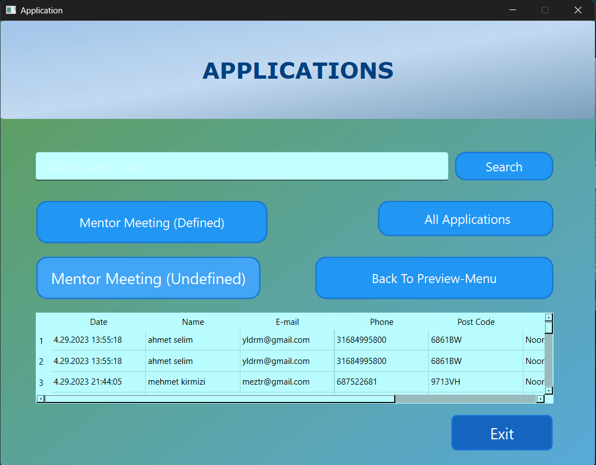
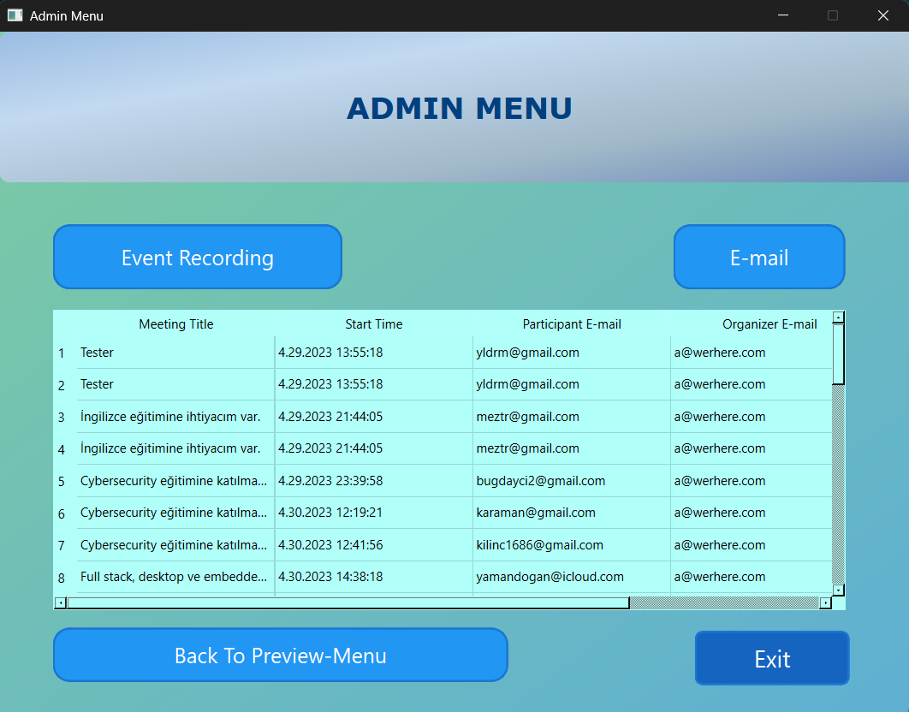
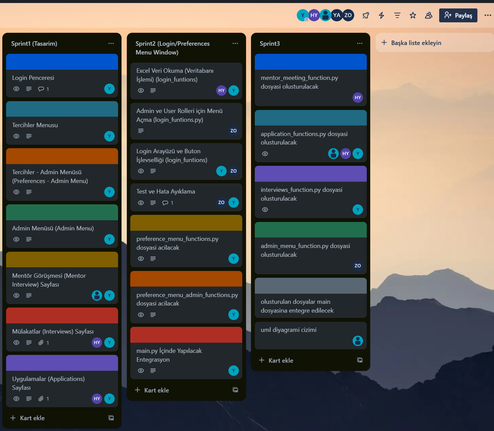

# CRM Projesi (Customer Relationship Management)

<p align="center">  </p>


## Proje Hakkında
Bu proje, Google Drive üzerinden yürütülen adayların başvuru, mentor görüşmesi ve mülakat süreçlerini kolaylaştırmak amacıyla geliştirilen bir Müşteri İlişkileri Yönetimi (CRM) uygulamasıdır.

## Özellikler
- **Kullanıcı Yönetimi**: Admin ve User yetkileriyle çoklu kullanıcı desteği
- **Entegrasyonlar**: Google Drive ve Google Takvim entegrasyonu
- **Başvuru Yönetimi**: Aday başvurularını filtreleme ve yönetme
- **Mentor Görüşmeleri**: Mentor atama ve takip sistemi
- **Mülakat Yönetimi**: Mülakat süreçlerini takip etme
- **Otomatik Mail**: Etkinlik bildirimleri için otomatik mail gönderimi

## Teknoloji Yığını
- **Programlama Dili**: Python
- **GUI Framework**: PyQt6
- **Veri Depolama**: JSON
- **Google Entegrasyonları**: 
  - Google Drive API
  - Google Calendar API
- **Versiyon Kontrol**: Git/GitHub

## Kurulum
1. Depoyu klonlayın:
   ```bash
   git clone https://github.com/Harriery/my-python-projects/blob/main/Customer%20Relationship%20Management/README.md

2. Gerekli bağımlılıkları yükleyin:
    ```bash
    pip install -r requirements.txt


3. Google API kimlik bilgilerini ayarlayın (Yönergeler için API_SETUP.md dosyasına bakın)

## Kullanım

1. Uygulamayı başlatın:

    ```bash
    python main.py

2. Giriş bilgilerinizi girin (Admin veya User yetkileriyle)

<p align="left">  </p>

3. İhtiyacınıza göre modülleri kullanın:

 **Başvuru Yönetimi**

 **Mentor Görüşmeleri**

 **Mülakat Takibi**

 **Admin Paneli**


 ## Ekran Görüntüleri


### Giriş Ekranı 
<p align="center">  </p>

### Tercihler Paneli (Admin - Kullanici) 


<div style="display: flex; gap: 10px; justify-content: center;">   </div>

 ### Başvuru Yönetimi Paneli
<p align="center">  </p>


 ### Mentor Atama Ekranı
<p align="center">  </p>


 ### Admin Paneli
<p align="center">  </p>

### Interviews Paneli
<p align="center">  </p>

 ### Proje Süreci:
  Bu proje, Trello üzerinden görev takibi ve günlük 30 dakikalık toplantılarla yönetilmiştir. UML diyagramları ve kullanım senaryoları proje öncesinde hazırlanmıştır.
<p align="center">  </p>  

 
## Katkıda Bulunanlar

[Takım Lideri Yasin UTUK] - Proje Yöneticisi & Frontend-Backend Geliştirici 

[Islam Kavas] - Backend Geliştirici

[Zehra Okay] - Backend Geliştirici

[Haluk Levent Yildirim] - Frontend-Test Mühendisi

Son Teslim: 11/06/2025 tarihinde sunum hazırlıkları tamamlanmıştır.