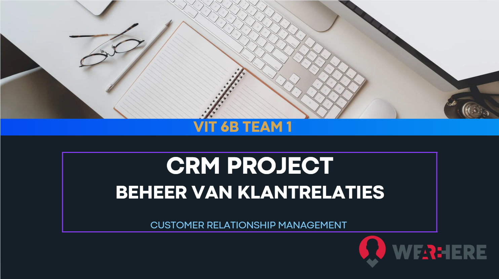
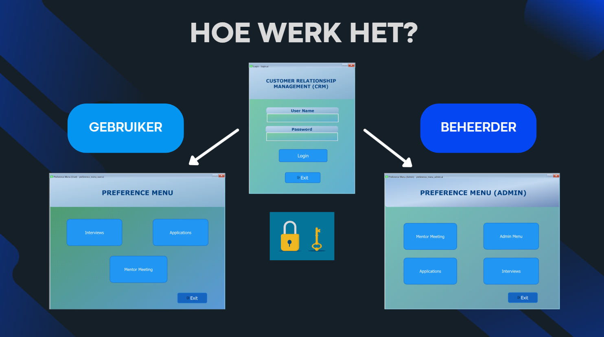
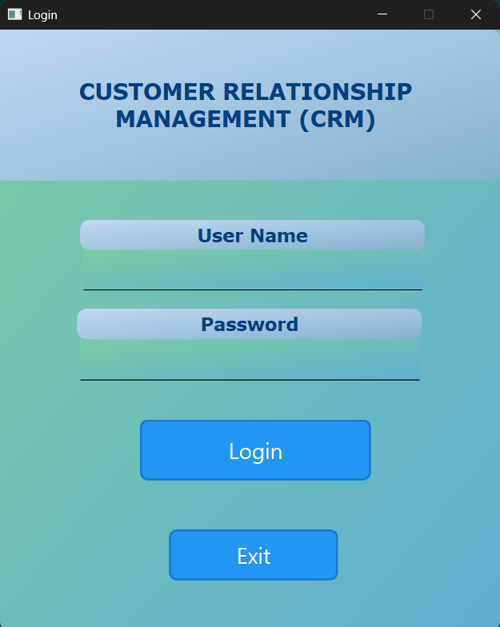
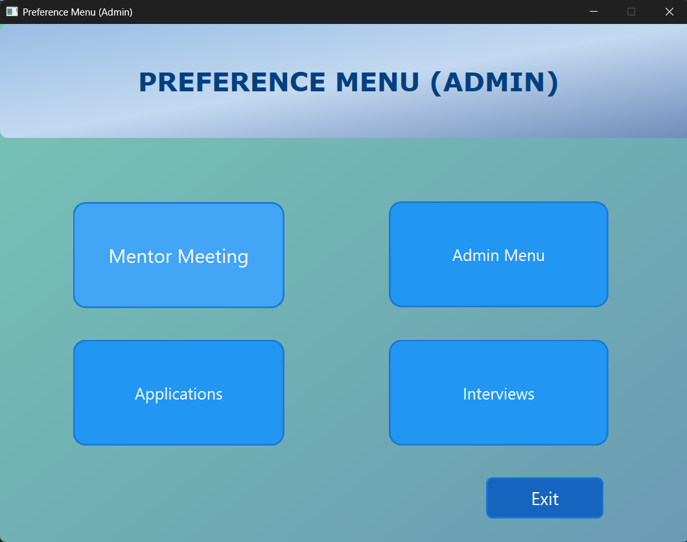
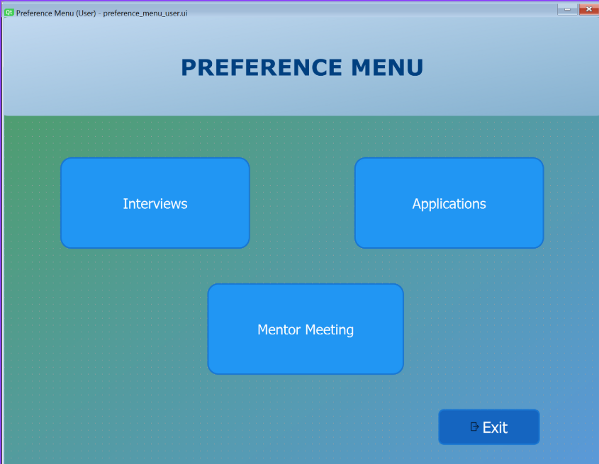
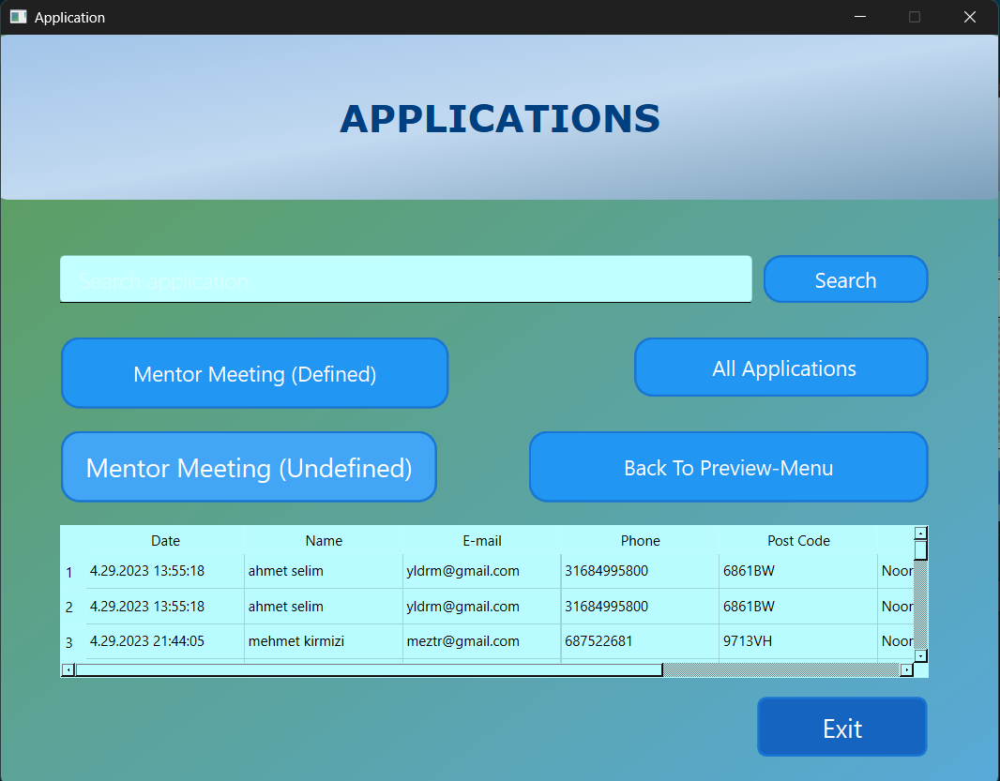
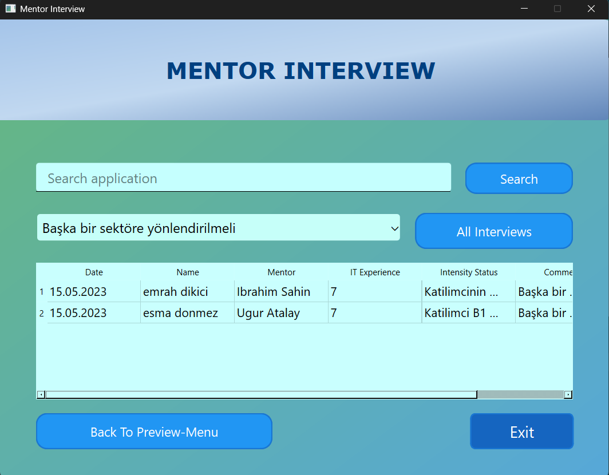
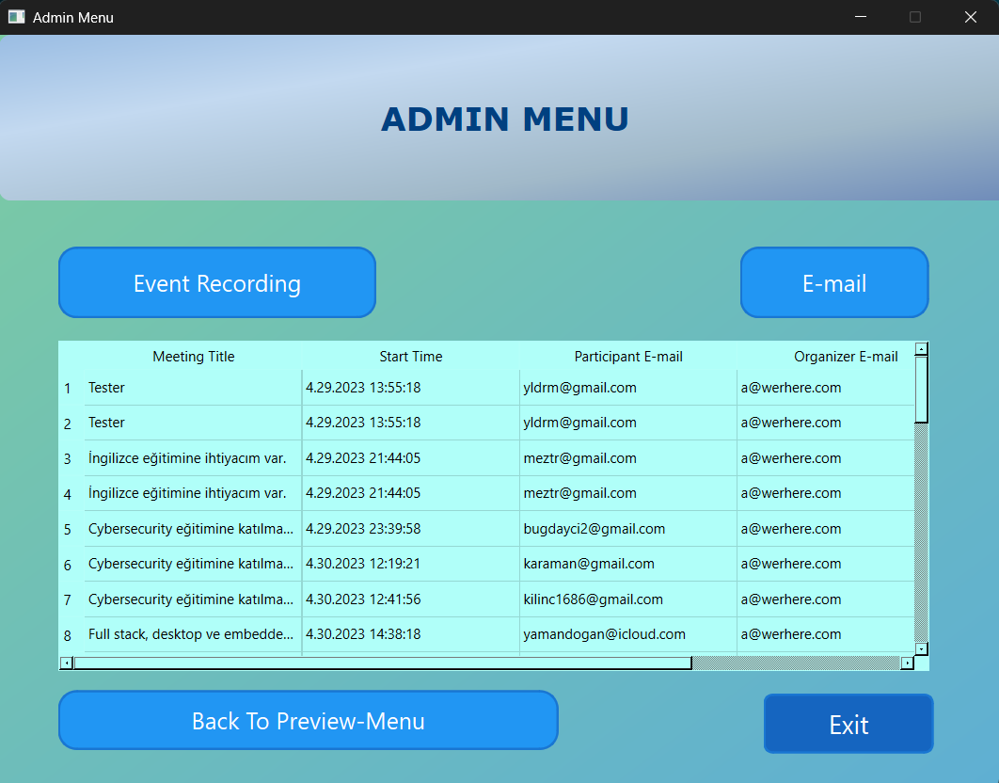
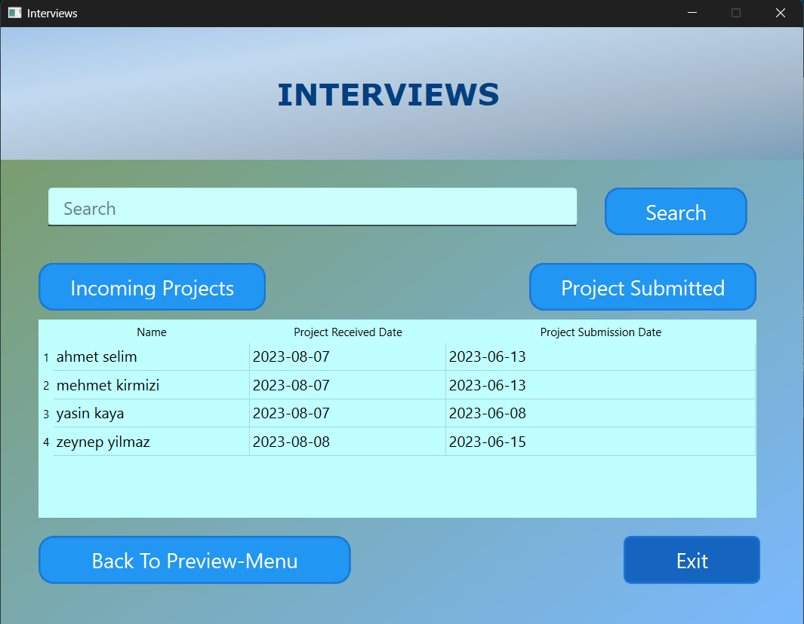
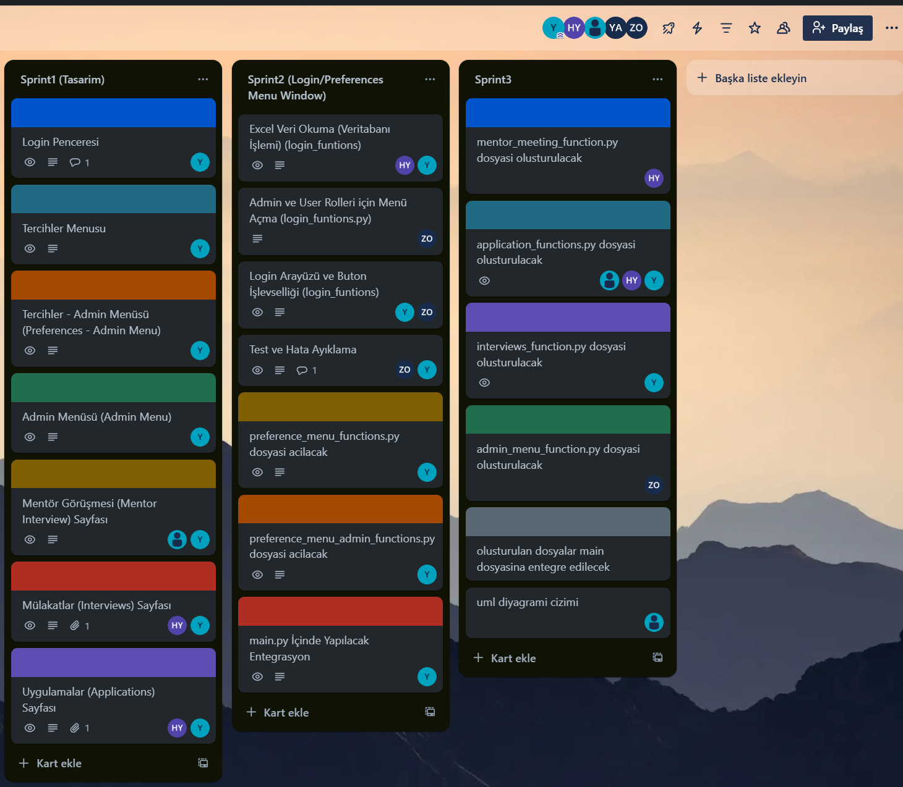

# CRM Project (Customer Relationship Management)

<p align="center">  </p>

## Over het Project
Dit project is een Customer Relationship Management (CRM) applicatie ontwikkeld om het beheer van sollicitaties, mentorgesprekken en interviews voor kandidaten te vereenvoudigen, waarbij Google Drive als basis wordt gebruikt.

## Kenmerken
- **Gebruikersbeheer**: Ondersteuning voor meerdere gebruikers met Admin en User rechten
- **Integraties**: Google Drive en Google Kalender integratie
- **Sollicitatiebeheer**: Filteren en beheren van kandidaatsollicitaties
- **Mentorgesprekken**: Systeem voor mentor-toewijzing en opvolging
- **Interviewbeheer**: Opvolging van interviewprocessen
- **Automatische mail**: E-mailnotificaties voor evenementen

## Technologie Stack
- **Programmeertaal**: Python
- **GUI Framework**: PyQt6
- **Dataopslag**: JSON
- **Google Integraties**: 
  - Google Drive API
  - Google Calendar API
- **Versiebeheer**: Git/GitHub

## Installatie
1. Kloon de repository:
   ```bash
   git clone https://github.com/Harriery/my-python-projects/blob/main/Customer%20Relationship%20Management/README.md

2. Installeer de vereiste afhankelijkheden:

    ```bash
    pip install -r requirements.txt
    
3. Configureer Google API referenties (zie API_SETUP.md voor instructies)


## Gebruiksaanwijzing
1. Start de applicatie:

  ```bash
  python main.py
  ```
2. Voer uw inloggegevens in (Admin of User rechten)

<p align="left">  </p>


3. Gebruik de modules naar behoefte:

 **Aanvraagbeheer**

 **Mentorgesprekken**

 **Sollicitatiebeheer**

 **Admin Paneel**

## Schermafbeeldingen

### Inlogscherm

<p align="center">  </p>

### Voorkeuren Paneel (Admin - Gebruiker)
<div style="display: flex; gap: 10px; justify-content: center;">   </div>

### Aanvraagbeheer Paneel
<p align="center">  </p>

### Mentor Toewijzingsscherm
<p align="center">  </p>

### Admin Paneel
<p align="center">  </p>

### Sollicitatie Paneel
<p align="center">  </p>

## Projectproces:
Dit project werd beheerd via Trello met dagelijkse 30-minuten vergaderingen. UML diagrammen en gebruiksscenario's werden vooraf voorbereid.

<p align="center">  </p>


## Bijdragers
[Teamleider Yasin UTUK] - Projectmanager & Frontend-Backend Ontwikkelaar

[Islam Kavas] - Backend Ontwikkelaar

[Zehra Okay] - Backend Ontwikkelaar

[Haluk Levent Yildirim] - Frontend-Test Engineer

**Laatste levering:** Presentatievoorbereidingen werden voltooid op 11/06/2025.